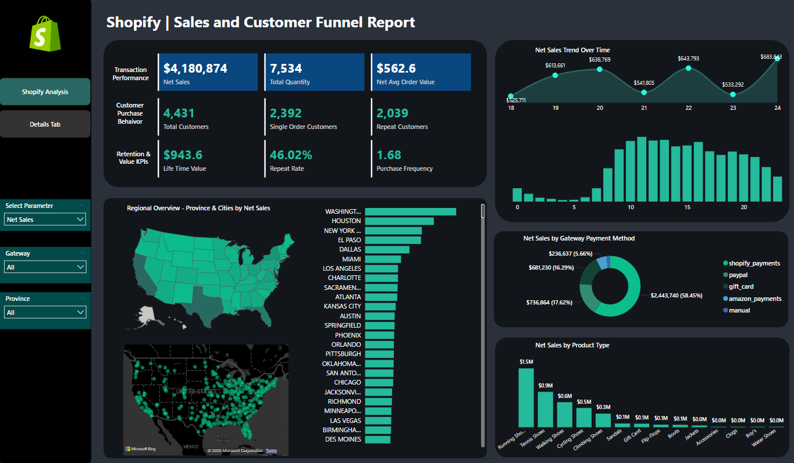
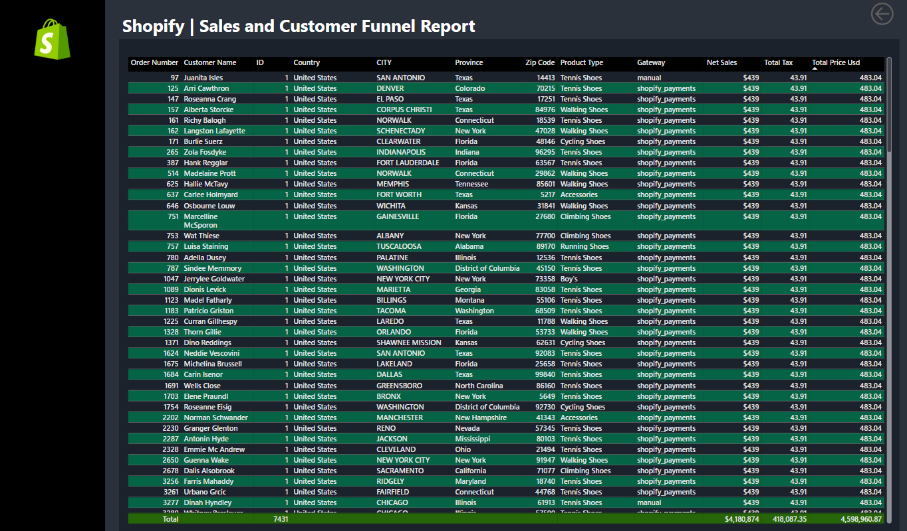
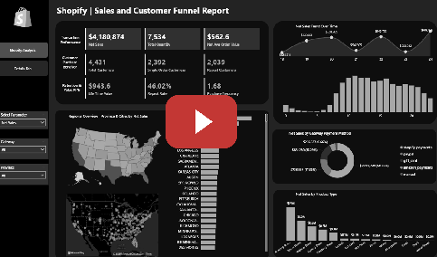

# **Shopify Performance Dashboard**  
*Data-Driven Insights for Revenue, Customer Behavior, and Retention*  

*A Power BI dashboard analyzing transactional performance, customer segmentation, and loyalty drivers to optimize Shopify store operations.*  

---

## 🎥 **Demo & Preview**  
  
*(Click image to watch full demo)* 

## ✨ **Dashboard Overview**  

| **Section**               | **Key Focus**                                                                 |
|---------------------------|-------------------------------------------------------------------------------|
| **Revenue & Volume**      | Net sales, order volume, and average order value trends.                      |
| **Customer Mix**          | Breakdown of single-order vs. repeat buyers and regional performance.         |
| **Value & Loyalty**       | Lifetime value (LTV), repeat rates, and purchase depth to gauge retention.    |
| **Payment & Product Analysis** | Gateway performance and product-type contribution to sales.               |

---

## 📊 **Core KPIs**  

| **Metric**                  | **Why It Matters**                                                                 |
|-----------------------------|-----------------------------------------------------------------------------------|
| **Net Sales**               | Total revenue after tax health metric is USD dollar.                         |
| **Avg Order Value (AOV)**   | Revenue per transaction; identifies upsell opportunities.                         |
| **Repeat Customer Rate**    | % of customers with >1 order; measures loyalty.                                   |
| **Lifetime Value (LTV)**    | Predicts long-term revenue per customer to justify acquisition costs.             |
| **Payment Gateway Split**   | Reveals fee inefficiencies (e.g., PayPal vs. Shopify Payments).                   |

---

## 🛠️ **Tech Stack**  

| **Tool**               | **Use Case**                                                                |
|------------------------|----------------------------------------------------------------------------|
| **Power BI Desktop**   | Data modeling, DAX measures, and interactive visualizations.               |
| **Power Query**        | Cleansing raw Shopify CSV exports (orders, customers, products).           |
| **DAX Formulas**       | Dynamic calculations (e.g., rolling LTV, YoY growth).                      |
| **Custom Visuals**     | U.S. map for regional drill-downs, Pareto charts for product analysis.     |

---

## 🔥 **Key Insights & Interactions**  

### **1. Regional Performance**  
- **Clickable U.S. map** filters all visuals by state/city to isolate top markets.  
- *Why it matters*: Identifies underperforming regions for targeted campaigns.  

### **2. Time-Series Trends**  
- **Hourly/daily sales trends** with granularity toggle to pinpoint demand spikes.  
- *Why it matters*: Optimize ad spend and staffing around peak hours.  

### **3. Payment Gateway Efficiency**  
- **Net sales split by gateway** (Shopify Payments, PayPal, etc.).  
- *Why it matters*: Highlights fee-heavy gateways eroding margins.  

### **4. Product-Type Pareto Analysis**  
- **Top 20% of product types** driving 80% of sales (shaded for emphasis).  
- *Why it matters*: Double down on high-impact SKUs; reevaluate low performers.  

### **5. Drill-Through Details**  
- **Right-click any visual** to access transaction-level data or export to CSV.  
- *Why it matters*: Self-service analytics without SQL queries.  

---
